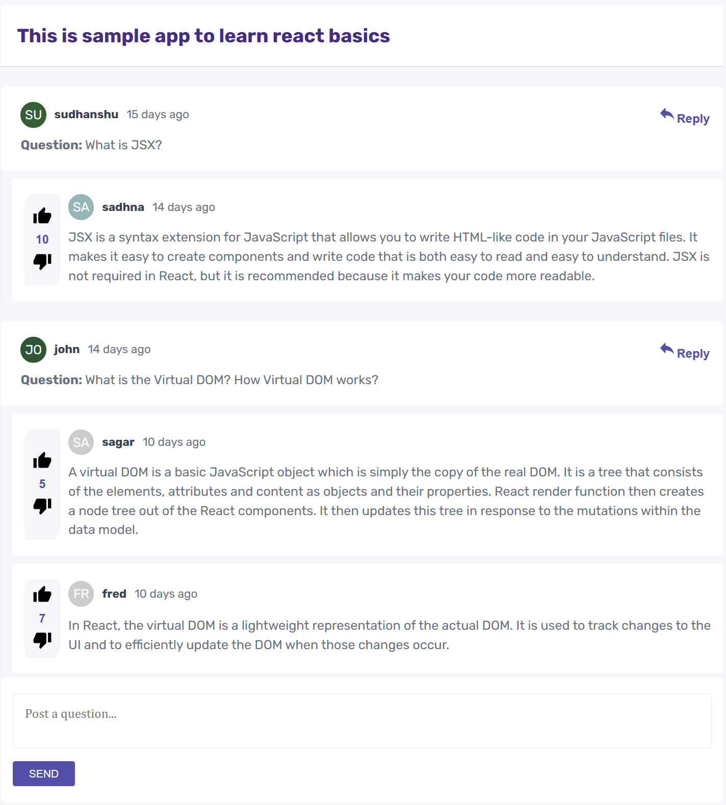

# React Learning Project
Repository contains react hands-ons sample project

## Description

This project is a very simple application built with React JS. The application allows users to post questions and other users can answer. It also allows users to give thumps-up & thumps-down to the posted answers. The application is styled using CSS and uses React Router to navigate between pages. This project is still in Development.

### Sample Screen Snippet.

